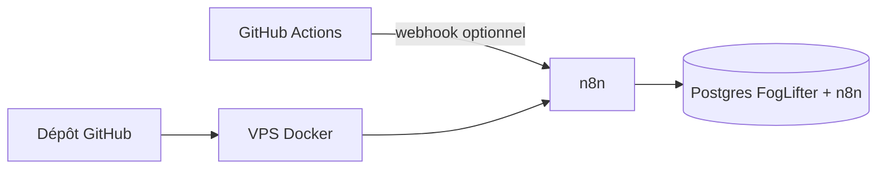

# FogLifter / Clarity — hub du dépôt

<div align="center">

[](https://github.com/haynbroit-alt/Agent-auto-)
[](https://github.com/haynbroit-alt/Agent-auto-/actions/workflows/foglifter-engine.yml)
[](./LICENSE)

[](./docs/00-DEMARRAGE.md)
[](./docs/INDEX.md)
[](./AGENTS.md)
[](./CONTRIBUTING.md)

</div>

**Commence par** [`docs/00-DEMARRAGE.md`](docs/00-DEMARRAGE.md) (parcours en 10 étapes, carte des docs, dépannage).  
**Vue d’ensemble de toute la doc** : [`docs/INDEX.md`](docs/INDEX.md).  
**Agents IA** : lis [`AGENTS.md`](AGENTS.md) avant toute modification.

Ce dépôt contient une **usine à signaux** modulaire :

- **Composer 1** — matching entreprise ↔ subvention : `workflows/foglifter-main.json`, `sql/001_foglifter_schema.sql`.
- **Composer 2** — arbitrage réglementaire ↔ instruments : `workflows/foglifter-arbitrage.json`, `sql/003_arbitrage_schema.sql`, index `sql/005_performance_indexes.sql`.

## En 30 secondes

```bash
# Dépôt public de référence (remplace par ton fork si besoin)
git clone https://github.com/haynbroit-alt/Agent-auto-.git
cd Agent-auto-
cp .env.example .env   # puis édite les lignes OBLIGATOIRES
make check
make up
```

Puis importe les workflows dans n8n et configure les **credentials** Postgres + Telegram (détail dans [`docs/00-DEMARRAGE.md`](docs/00-DEMARRAGE.md)).

## Schéma



## Documentation (index)

| Sujet | Fichier |
|-------|---------|
| **Démarrage guidé** | [`docs/00-DEMARRAGE.md`](docs/00-DEMARRAGE.md) |
| **Index de toute la doc** | [`docs/INDEX.md`](docs/INDEX.md) |
| **Agents (IA)** | [`AGENTS.md`](AGENTS.md) |
| **Contribuer** | [`CONTRIBUTING.md`](CONTRIBUTING.md) |
| VPS, mobile, migrations | [`docs/GUIDE-COMPLET.md`](docs/GUIDE-COMPLET.md) |
| Composer 2 | [`docs/COMPOSER-2-ARBITRAGE.md`](docs/COMPOSER-2-ARBITRAGE.md) |
| Performance, backups, HTTPS | [`docs/PERFORMANCE-ET-EXPLOITATION.md`](docs/PERFORMANCE-ET-EXPLOITATION.md) |
| Architecture GitHub + cloud | [`docs/ARCHITECTURE-GITHUB-CENTRE.md`](docs/ARCHITECTURE-GITHUB-CENTRE.md), [`docs/GITHUB-ACTIONS-SECRETS.md`](docs/GITHUB-ACTIONS-SECRETS.md) |
| **Render (Dockerfile n8n)** | [`docs/RENDER.md`](docs/RENDER.md) |
| Make.com | [`docs/MAKE-COM-NOCODE.md`](docs/MAKE-COM-NOCODE.md) |

## Raccourcis Makefile

`make help` — voir `Makefile` (`check`, `up`, `down`, `logs`, `logs-n8n`, `backup`, `ps`).

## Fichiers techniques utiles

| Rôle | Chemin |
|------|--------|
| Stack Docker | `docker-compose.yml` |
| Orchestration planifiée | `.github/workflows/foglifter-engine.yml` |
| Sauvegardes | `scripts/backup-foglifter.sh`, `scripts/restore-foglifter.sh` |
| Vérifs locales | `scripts/check-environment.sh` |
| TLS (exemple) | `docker/caddy/Caddyfile.example` |

## Roadmap (rappel)

Composer 3 → 5 : narrative / marketplace / fonds — voir fin de `docs/GUIDE-COMPLET.md` et `AGENTS.md` pour ne pas dériver hors périmètre.

## Avertissement

**Composer 2** produit des signaux techniques, pas des conseils en investissement (conformité AMF / MiFID selon ton cas).
