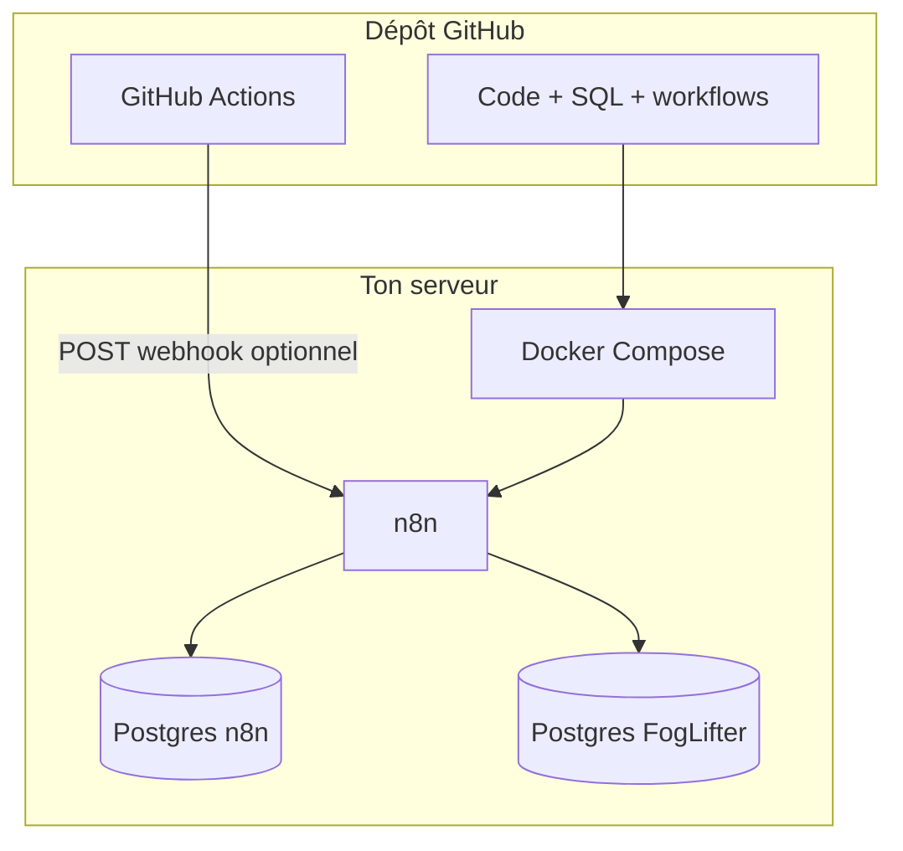

# FogLifter / Clarity Layer — démarrage rapide

**Bienvenue dans l’usine à signaux.** Lis ce fichier en premier : il indique la suite selon que tu sois humain ou agent automatisé.

---

## En 30 secondes

```bash
# Dépôt public de référence (remplace par ton fork si besoin)
git clone https://github.com/haynbroit-alt/Agent-auto-.git
cd Agent-auto-
cp .env.example .env
# Édite .env : section OBLIGATOIRE (mots de passe, OPENAI_API_KEY, TELEGRAM_CHAT_ID, N8N_ENCRYPTION_KEY en prod)
make check
make up
```

*(Tu peux aussi cloner une autre URL : remplace la première ligne par ton dépôt.)*

Puis ouvre n8n sur `http://IP_DU_SERVEUR:5678`, importe `workflows/foglifter-main.json` et `workflows/foglifter-arbitrage.json`, et crée les **credentials** Postgres + Telegram (+ LLM si tu ne passes pas par `$env`).

---

## Carte des documents

| Fichier | Rôle |
|---------|------|
| `docs/00-DEMARRAGE.md` | **Point d’entrée** — ce fichier |
| `AGENTS.md` | Règles pour toute modification (humain ou IA) |
| `docs/GUIDE-COMPLET.md` | VPS, mobile, migrations SQL, sécurité |
| `docs/COMPOSER-2-ARBITRAGE.md` | Composer 2 (arbitrage réglementaire) |
| `docs/PERFORMANCE-ET-EXPLOITATION.md` | Backups, HTTPS, tuning, scaling |
| `docs/ARCHITECTURE-GITHUB-CENTRE.md` | Vision modulaire (GitHub + cloud) |
| `docs/GITHUB-ACTIONS-SECRETS.md` | Secrets Actions, webhooks, cron UTC |
| `docs/INDEX.md` | Liste ordonnée de **toute** la documentation Markdown |
| `CONTRIBUTING.md` | Comment contribuer + PR |
| `docs/MAKE-COM-NOCODE.md` | Variante Make.com |
| `README.md` | Hub synthétique du dépôt |
| `LICENSE` | Licence MIT |
| `SECURITY.md` | Signalement de vulnérabilités |
| `docs/RENDER.md` | Déploiement **n8n sur Render** (Dockerfile racine) |
| `Dockerfile` | Image n8n pour Render (le local reste `docker compose`) |

---

## Les 10 étapes (parcours humain)

| Étape | Action | Détail |
|:-----:|--------|--------|
| 1 | Clone le dépôt | Sur le VPS ou une machine avec Docker |
| 2 | Environnement | `cp .env.example .env` puis remplir **OBLIGATOIRE** |
| 3 | Vérification | `make check` ou `./scripts/check-environment.sh` |
| 4 | Lancement | `make up` ou `docker compose up -d` |
| 5 | n8n | Ouvre `http://IP:5678` (HTTPS ensuite — voir doc perf) |
| 6 | Workflows | Importe `workflows/foglifter-main.json` puis `foglifter-arbitrage.json` |
| 7 | Credentials | Postgres hôte `foglifter-postgres`, Telegram, alignés sur `.env` |
| 8 | Données test | Optionnel : `sql/002_seed_example_companies.sql` et `sql/004_seed_arbitrage_instruments.sql` (via `psql`, voir guides) |
| 9 | Migrations | Si le volume Postgres **existait déjà**, appliquer `005` etc. manuellement (`docs/GUIDE-COMPLET.md`) |
| 10 | Validation | **Execute Workflow** manuel sur Composer 1 → vérifie Telegram / tables |

Ensuite : **sécurité et charge** → `docs/PERFORMANCE-ET-EXPLOITATION.md`. **GitHub Actions** → `docs/GITHUB-ACTIONS-SECRETS.md`. **Avant toute modif de code** → `AGENTS.md`.

---

## Tu es un agent IA (Cursor, cloud, etc.)

1. Lis **`AGENTS.md`** en entier.
2. Ne **jamais** committer `.env`, clés API, ni mots de passe.
3. Après changement de **`docker-compose.yml`** ou SQL d’**initdb**, préciser si un volume Postgres **existant** nécessite une migration `psql` manuelle.
4. Valider les JSON n8n : `python3 -m json.tool workflows/<fichier>.json`.
5. Éviter la duplication : un seul endroit pour le tutoriel long ; les autres fichiers renvoient ici.

---

## Schéma mental



---

## Dépannage express

| Symptôme | Piste |
|----------|--------|
| Port **5678** injoignable depuis l’extérieur | Pare-feu / security group : autoriser TCP 5678 **ou** (mieux) ne pas exposer n8n publiquement et passer par HTTPS + reverse-proxy |
| Ubuntu `ufw` (exemple) | `sudo ufw allow 22/tcp` puis, seulement si nécessaire en clair, `sudo ufw allow 5678/tcp` — en prod préfère **443** vers Caddy/Traefik |
| n8n ne démarre pas | `make logs-n8n` ou `docker compose logs n8n` — Postgres interne healthy ? |
| Erreur mot de passe Postgres | `.env` = mêmes valeurs que les credentials n8n pour `foglifter-postgres` |
| Webhooks n8n cassés | `WEBHOOK_URL` en `https://…` cohérent avec ton proxy |
| GitHub Action silencieuse | Secret `N8N_CRON_WEBHOOK_URL` absent ou URL incorrecte ; cron en **UTC** |
| Render : « open Dockerfile: no such file » | Le `Dockerfile` doit être sur la branche déployée (**racine**). Voir **`docs/RENDER.md`**. |

Pour le détail : **`docs/GUIDE-COMPLET.md`**.
