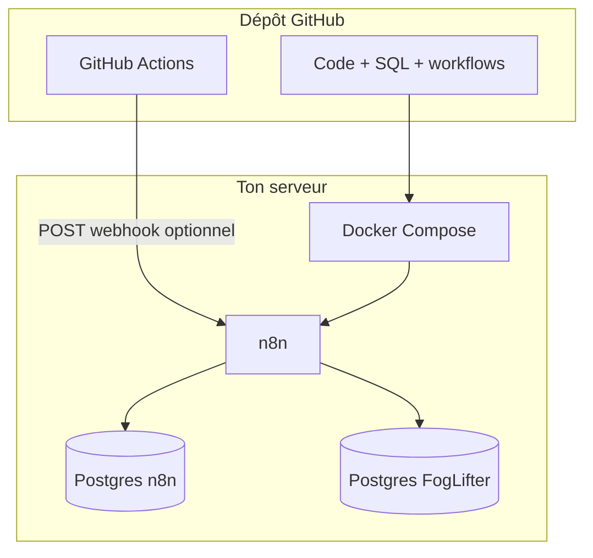

# Démarrage en une lecture — FogLifter / Clarity

**Lis ce fichier en premier.** Il te dit quoi ouvrir ensuite selon ton objectif. Tout le reste du dépôt est du détail.

---

## Tu es humain et tu veux que ça tourne vite

| Étape | Action | Détail |
|:-----:|--------|--------|
| 1 | Clone le dépôt sur ton serveur (ou ton PC avec Docker) | `git clone …` |
| 2 | Copie l’exemple d’environnement | `cp .env.example .env` |
| 3 | Remplis au minimum les **champs obligatoires** en tête de `.env` (voir commentaires `OBLIGATOIRE`) | Mots de passe DB, `OPENAI_API_KEY`, `TELEGRAM_CHAT_ID`, `N8N_ENCRYPTION_KEY` en prod |
| 4 | Vérifie que Docker est prêt | `make check` ou `./scripts/check-environment.sh` |
| 5 | Lance la stack | `make up` ou `docker compose up -d` |
| 6 | Ouvre n8n | `http://IP:5678` (puis mets HTTPS — voir perf) |
| 7 | Importe les workflows | `workflows/foglifter-main.json` puis `workflows/foglifter-arbitrage.json` |
| 8 | Crée les **credentials** Postgres (hôte `foglifter-postgres`) et Telegram dans n8n | Même user/mot de passe que `.env` |
| 9 | Si ta base **existait déjà** avant les derniers SQL, applique les migrations manquantes | Voir `docs/GUIDE-COMPLET.md` § migrations |
| 10 | Exécute un workflow à la main dans n8n | Valide Telegram / Postgres |

Ensuite : **sécurité et charge** → `docs/PERFORMANCE-ET-EXPLOITATION.md`. **GitHub Actions** → `docs/GITHUB-ACTIONS-SECRETS.md`.

---

## Tu es un agent IA (Cursor, cloud, etc.)

1. Lis **`AGENTS.md`** — règles de contribution et d’autonomie pour ce dépôt.
2. Ne **jamais** committer `.env`, clés API, ni mots de passe.
3. Après modification de **`docker-compose.yml`** ou des **SQL** d’init, indique clairement si un **volume Postgres existant** exige une migration manuelle (`psql`).
4. Les workflows n8n sont des **exports JSON** : après édition, valider la syntaxe JSON (`python3 -m json.tool fichier.json`).
5. Préférer **`docs/00-DEMARRAGE.md`** + **`README.md`** pour orienter l’utilisateur ; ne pas dupliquer de longs tutoriels dans plusieurs fichiers sans lien croisé.

---

## Carte des documents (une ligne chacun)

| Fichier | Rôle |
|---------|------|
| `README.md` | Hub : liens + tableau des docs |
| `docs/00-DEMARRAGE.md` | **Point d’entrée** — 10 étapes + carte + dépannage |
| `docs/GUIDE-COMPLET.md` | VPS, mobile, n8n, migrations SQL détaillées |
| `docs/COMPOSER-2-ARBITRAGE.md` | Arbitrage réglementaire (Composer 2) |
| `docs/PERFORMANCE-ET-EXPLOITATION.md` | Perf Postgres/n8n, backups, HTTPS, scaling |
| `docs/ARCHITECTURE-GITHUB-CENTRE.md` | Vision modulaire GitHub + briques cloud |
| `docs/GITHUB-ACTIONS-SECRETS.md` | Secrets Actions, webhook n8n, cron UTC |
| `docs/MAKE-COM-NOCODE.md` | Alternative Make.com |
| `AGENTS.md` | Instructions pour agents automatisés |

---

## Schéma mental (une image)

---

## Dépannage express

| Symptôme | Piste |
|----------|--------|
| n8n ne démarre pas | `docker compose logs n8n` — Postgres n8n pas healthy ? |
| Erreur « password » Postgres | `.env` aligné avec credentials n8n pour `foglifter-postgres` |
| Webhooks n8n cassés | `WEBHOOK_URL` en `https://…` derrière ton reverse-proxy |
| GitHub Action ne déclenche rien | Secret `N8N_CRON_WEBHOOK_URL` absent ou URL incorrecte ; cron en **UTC** |

Pour aller plus loin : mêmes étapes, mais tu lis **`docs/GUIDE-COMPLET.md`** au lieu de résumer ici.
